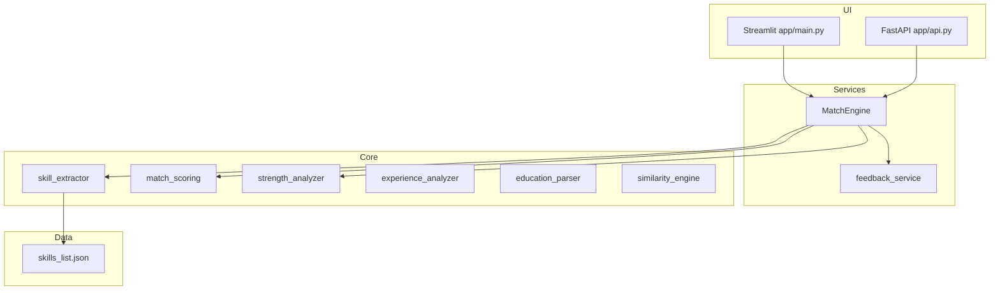

# Architecture

## Overview

ResumeMatch AI is a layered Python application: **core** logic, **services** orchestration, **utils** for I/O, and **Streamlit/FastAPI** interfaces.

## Data flow: single match

1. User uploads PDF/DOCX → `file_handlers.parse_uploaded_file`
2. Text sanitized → `validators.sanitize_text`
3. `MatchEngine.match_resume_to_job`:
   - Extract resume skills (dictionary + regex)
   - Extract job skills (dictionary + spaCy keywords)
   - `identify_skill_gap` → `calculate_match_score`
   - Generate feedback, ATS score, benchmark, cover letter draft
4. UI renders metrics, charts, expanders

## Data flow: batch ranking

1. Multiple files or ZIP extracted
2. For each resume, `match_resume_to_job` computes score
3. If more than 5 resumes, `ProcessPoolExecutor` parallelizes scoring
4. `rank_resumes` sorts candidates

## Design decisions

| Decision | Rationale |
|----------|-----------|
| Skill dictionary + regex | Deterministic, testable skill matching |
| spaCy for job descriptions | Captures verbs/nouns not in static list |
| TF-IDF similarity | Lightweight, no training data required |
| Rule-based ATS score | Transparent, explainable vs black-box ML |
| `@st.cache_data` | Avoids reloading spaCy/skills on reruns |

## Testing strategy

- **Unit tests** per core module (parametrized edge cases)
- **Integration tests** for end-to-end match and rank flows
- **API tests** via FastAPI TestClient
- **Coverage gate** ≥ 85% in CI (`pytest-cov`)

## Configuration

Environment variables (see `.env.example`):

- `SPACY_MODEL` — spaCy pipeline name
- `LOG_LEVEL` — logging verbosity
- `MAX_FILE_SIZE` — upload limit in bytes
